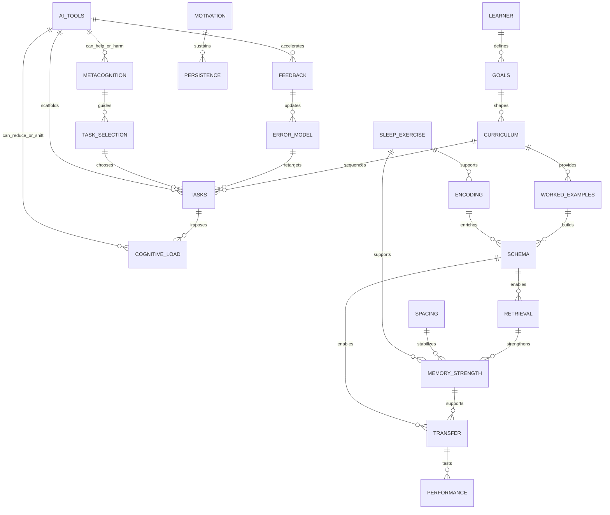
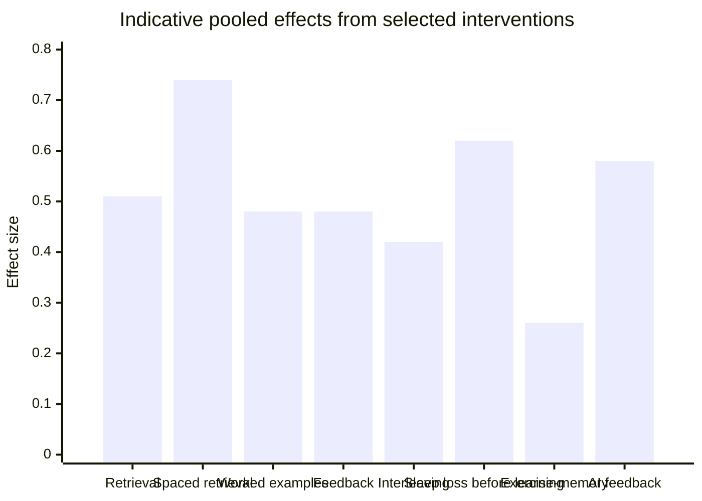
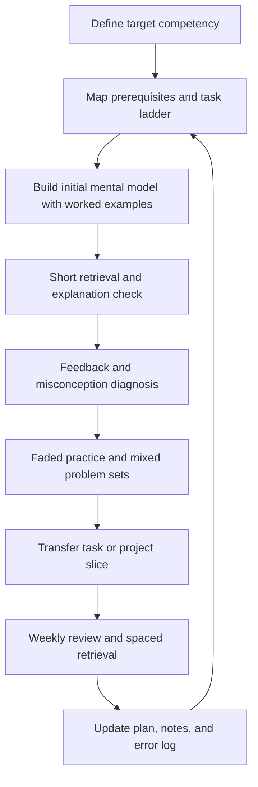
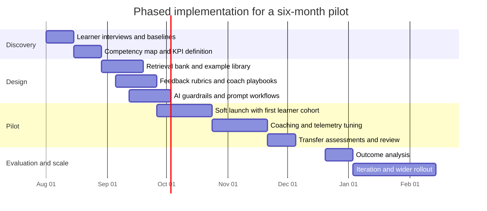

# Building an Evidence-Based Learning System for Adult Technical Self-Study in the Age of AI

## Executive Summary

An effective learning system for adult technical self-study is not a stack of study “tips.” It is a coordinated design that aligns five things: clear target competencies, cognitively efficient sequencing, retrieval-centered memory strengthening, high-quality feedback and metacognitive calibration, and carefully bounded AI support. The research base strongly suggests that the highest-leverage changes are usually not exotic: practice testing and distributed practice remain among the most powerful general techniques; explanatory feedback outperforms simple right-or-wrong feedback; worked examples help novices more than unguided problem solving; interleaving helps when categories are confusable; and sleep and physical activity meaningfully affect memory and cognitive performance. At the same time, the literature also shows that these benefits are conditional. Interleaving can hurt when material is too dissimilar, worked examples can lose value as expertise rises, and AI can either improve learning through timely personalized scaffolding or degrade it through cognitive offloading and answer dependence. citeturn25view0turn22view0turn24search0turn11search1turn27search1turn36search2turn38view0

For adult technical learners, the best system is usually a layered one: first define the competence to be demonstrated, then build a prerequisite-aware sequence, use examples to form schemas, switch rapidly into retrieval and explanation, intensify practice under feedback, and finish each cycle with transfer tasks that require selecting methods without being told which one to use. AI belongs inside this loop as a constrained coach, reviewer, quiz generator, debugger, and Socratic prompt engine—not as a default answer machine. On present evidence, a medium-investment architecture that combines off-the-shelf tools, structured retrieval, guarded AI feedback, and light human coaching is likely to offer the best cost-to-learning ratio for most serious adult learners or cohort-based programs. High-investment systems are justified when scale, analytics, compliance, or domain-specific tutoring quality materially matter. citeturn33view0turn23view0turn19search0turn19academia49turn21search2turn20search2

## Scope, Objectives, and Assumptions

This report addresses **adult, self-directed learners** studying technical and conceptual domains such as software engineering, mathematics, AI, databases, distributed systems, and related fields that require both conceptual understanding and practical performance. Because the user did not specify a cohort size, budget ceiling, organization type, or compliance environment, I make four explicit assumptions for the architecture, budget, and implementation sections: the deployment is primarily remote; the pilot duration is six months; the comparison architectures are sized for an illustrative cohort of **100 adult learners**; and the target outcomes are delayed retention, transfer to unfamiliar tasks, and production of independent technical artifacts rather than only exam scores. These are assumptions for planning, not sourced facts. 

The objectives are to identify the major layers of an evidence-based learning system, estimate the relative value of core interventions, show how the layers interact, compare realistic system architectures, and translate the literature into prioritized recommendations for practical adoption. The report prioritizes **recent evidence from the last five years** where possible, but it includes older seminal work where the newer literature still depends on those frameworks—for example, on learning styles, deliberate practice, and testing effects. UNESCO’s guidance additionally makes a human-centered case for AI use in education that emphasizes privacy, ethics, and age-appropriate pedagogical design rather than unbounded automation, which is directly relevant to adult self-study system design in the AI era. citeturn33view0turn14search0turn12search0turn10search1

The central working hypothesis of this report is that the largest durable gains come from **layer alignment**, not from optimizing any single technique in isolation. In practice, that means retrieval without understanding is weak, projects without focused drills are inefficient, deliberate practice without feedback plateaus, and AI without guardrails can create false mastery. That synthesis is consistent with both the learning-science literature and recent GenAI-in-education findings showing that outcomes depend heavily on pedagogy, moderation, and the difference between scaffolding and substitution. citeturn33view0turn38view0turn19search0turn20search2

## Methodology and Source Prioritization

The evidence search prioritized **official and primary sources first**, then recent systematic reviews and meta-analyses, then newer experimental or quasi-experimental studies in directly relevant domains. Official sources included UNESCO, OECD, U.S. Department of Education and IES, CDC, NIH/NICHD, and NBER. Academic sources included PubMed/PMC, Springer, Sage, Wiley, Frontiers, Cambridge, and selected arXiv preprints when they added unique design insight or very recent evidence not yet heavily cited elsewhere. Because the topic mixes education, cognition, health, workplace AI, and technical self-study, no single database was sufficient. 

Selection criteria favored: publication years **2021–2026**; adult, postsecondary, or authentic classroom settings where available; systematic reviews and meta-analyses over isolated studies; peer-reviewed journal articles over secondary commentary; and outcomes related to learning, retention, transfer, metacognition, or real task performance. Older sources were retained only when they remained foundational or when no stronger recent direct equivalent existed. Claims are therefore based on a mixture of strong, moderate, and emerging evidence. Strong evidence in this report means replicated reviews/meta-analyses or official guidance; moderate evidence means solid but indirect or population-limited findings; emerging evidence means promising but heterogeneous recent AI and domain-specific studies. 

A notable methodological limitation is that much of the learning-techniques literature still relies on **surface or short-delay outcomes**. In one broad synthesis of ten learning techniques, the authors note that most studies centered on surface or factual outcomes, and about 68% of the studies measured performance within a day; that means transfer-heavy technical performance remains less directly studied than factual retention. Recent adult-relevant evidence exists for sleep, exercise, and AI-supported task performance, but direct evidence specifically on **self-directed adult technical learners** remains thinner than evidence from K-12, undergraduates, or laboratory memory tasks. citeturn25view0turn26view1turn27search1turn20search2

A concise map of the sources searched is below.

| Source class | Priority | Examples used in this report | Why it mattered |
|---|---:|---|---|
| Official guidance and policy | Highest | UNESCO, OECD, U.S. DOE/IES, CDC, NIH/NICHD | Established guardrails, current AI-in-education context, health baselines |
| Systematic reviews and meta-analyses | Highest | practice testing, spacing, worked examples, feedback, interleaving, sleep, exercise, AI feedback | Best available pooled estimates and moderator analysis |
| Experimental and quasi-experimental studies | High | classroom retrieval/interleaving, programming scaffolds, Tutor CoPilot, technology-supported tutoring | Design details and ecological validity |
| Seminal older literature | Conditional | learning styles, deliberate practice, practice testing | Still foundational where recent direct replacements are limited |

## Background, Key Questions, and System Model

The most useful way to think about adult technical learning is as a **multi-layer control system** rather than a sequence of isolated sessions. At minimum, the layers are: competency definition, curriculum sequencing, cognitive-load management, initial encoding, retrieval and spacing, practice design, feedback and metacognition, transfer, behavioral foundations, and AI/tooling policy. This layered view matches both older cognitive frameworks and newer syntheses showing that the most effective techniques are not standalone replacements for instructional design. Practice testing and distributed practice score highly across meta-analytic syntheses, but their value depends on what is being practiced, when it is introduced, and how it is corrected. citeturn25view0turn10search1turn9search5turn22view0

The practical questions that mattered most in the evidence were these: what should be learned first; how much assistance is optimal at a given expertise level; how should memory review be scheduled; what type of feedback closes the gap fastest; how should transfer be deliberately trained; and how can AI increase feedback frequency without taking over the actual thinking. The evidence suggests three governing hypotheses. First, **sequencing beats intensity** early: if prerequisites, examples, and task difficulty are badly chosen, adding more hours often amplifies confusion rather than learning. Second, **retrieval plus explanatory feedback** is the core engine of durable retention. Third, **AI helps most when it amplifies feedback loops and search costs, not when it performs the task end-to-end**. citeturn13search0turn24search0turn22view0turn23view0turn20search2

The interaction map below summarizes the system.

The most important design implication of this map is that **failure modes are usually cross-layer failures**. For example, “I can follow a tutorial but cannot build anything” is rarely just a retrieval problem; it usually combines poor goal definition, over-example dependence, insufficient fading, absent transfer tasks, and often AI over-assistance. Likewise, “my flashcard reviews are exploding” is usually not a spacing failure alone; it is often a curriculum and note-selection failure in which low-value details were promoted into the review system. These are system bugs, not just motivation bugs. citeturn24search0turn28search1turn33view0turn38view0

## Findings from the Evidence

The strongest general conclusion is that **adult technical learning should be organized around a schema-building and retrieval-correction loop**. Practice testing and distributed practice are among the highest-utility techniques in broad syntheses, but they are most effective after the learner has a minimally coherent mental model. Unguided difficulty too early is not “productive struggle”; it is often just extraneous load. A 2023 cognitive-load review argues that experienced task complexity depends on the interaction between information structure and what is already in long-term memory, which is why the same task is manageable for one learner and overwhelming for another. That is also why worked examples tend to benefit novices and then fade in value as expertise rises. citeturn25view0turn13search0turn24search0

An indicative comparison of pooled quantitative effects is below. These numbers should **not** be treated as directly comparable head-to-head rankings, because they reflect different populations, outcomes, and designs. They are still useful for scale.

| Intervention | Quantitative estimate | Interpretation for system design | Evidence strength |
|---|---:|---|---|
| Practice testing / retrieval practice | about **g = 0.51** versus restudy; larger versus filler/no activity; classroom psychology studies **d = 0.56** | One of the most reliable levers for durable retention; strongest when low stakes and corrected | Strong citeturn10search1turn10search4turn10search3 |
| Spaced retrieval versus massed retrieval | **g = 0.74** | Large benefit for retention; spacing helps even when practice feels harder | Strong citeturn9search5 |
| Worked examples in math | **g = 0.48** | Especially useful early, before fully independent problem solving; support should fade with skill | Strong-to-moderate citeturn24search0 |
| Educational feedback overall | **d = 0.48** | Feedback matters, but content matters more than the fact of feedback | Strong citeturn22view0 |
| Elaborated feedback in technology-rich settings | about **ES = 0.49**; knowledge-of-results-only around **0.05** | “Why/how to fix” beats “right/wrong” | Strong-to-moderate citeturn8search2 |
| Interleaving overall | **g = 0.42** overall; but **g = -0.39** for some word-learning studies | Use when categories/problems are confusable; do not interleave arbitrarily | Strong-to-moderate citeturn11search1 |
| Sleep deprivation before learning | **g = 0.621** impairment | Short sleep before study meaningfully harms encoding | Strong citeturn27search1 |
| Sleep deprivation after learning | **g = 0.277** impairment | Sleep also matters for consolidation after learning | Strong citeturn27search1 |
| Sleep restriction | **g = 0.29** impairment | Even partial restriction reduces memory formation | Strong citeturn27search0 |
| Exercise and memory | memory **SMD = 0.26** overall; acute exercise before encoding **d = 0.23**, after encoding **d = 0.33** | Exercise is foundational, not magic; short bouts can help learning readiness and consolidation | Strong-to-moderate citeturn36search2turn36search3 |
| AI-supported personalized feedback | learning **g = 0.58** and motivation **g = 0.82** in one meta-analysis; **g = 0.61** in another | AI feedback can work well, but heterogeneity and pedagogy matter greatly | Emerging-to-moderate citeturn23view0turn38view0 |
| Deliberate practice | explains roughly **4% of variance** in educational performance in one classic meta-analysis | Useful, but not a standalone explanation; quality of task design and feedback is decisive | Moderate, but indirect for self-study planning citeturn12search0 |

The evidence on **retrieval and spacing** is especially actionable. Practice testing reliably beats restudy, and spaced retrieval beats massed retrieval by a large margin. Yet the classroom literature also shows that spacing frequently makes practice feel worse before it works better. In calculus classrooms, spacing reduced early practice performance but improved end-of-semester retention, which is a textbook example of a desirable difficulty. For technical learners, this means the default workflow should not be “consume more explanation until it feels easy”; it should be “retrieve sooner than feels comfortable, then correct.” A concrete classroom study in chemical engineering found that end-of-class retrieval questions improved later review-quiz performance by about **30%**, which supports embedding retrieval into the learning event itself rather than postponing it to later revision. citeturn35search0turn35search5turn26view1

The evidence on **worked examples, fading, and sequence design** is equally important. A 2023 meta-analysis found a medium overall benefit of worked examples for mathematics performance, with stronger effects for correct examples than incorrect examples and a surprising negative moderation for self-explanation prompts in that dataset. That does not mean self-explanation is always bad; it means that extra prompts can add load or be badly specified, especially for novices. In programming specifically, a 2023 study found that **faded worked examples with metacognitive scaffolding** were the most effective combination for novice problem-solving programming and self-regulation. The design takeaway is straightforward: for adult technical self-study, begin topics with tightly scoped examples, then move to completion problems, then independent problems, and keep the metacognitive prompts short, task-bound, and concrete. citeturn24search0turn24search8turn28search1

The evidence on **interleaving** is positive but conditional, which matters because interleaving is widely oversimplified online. The best meta-analytic estimate shows a moderate overall benefit, but it also shows that gains are strongest when categories are similar and confusable and that blocked practice can outperform interleaving for some word-learning tasks. A classroom science study adds a practical benchmark: blocked quizzes improved delayed performance over unquizzed content, and **interleaved quizzes improved it further** over blocked quizzes. For adult technical learning, interleave among similar bug types, algorithm families, design trade-offs, or problem classes—not among random unrelated topics chosen just to make study feel harder. citeturn11search1turn11search0turn11search5

The evidence on **feedback** supports a very specific design choice: feedback should be explanatory, timely enough to correct misconceptions before they harden, and tied to the learner’s actual error model. The broad meta-analysis shows a medium overall effect, but it also shows that feedback is not one singular treatment. In technology-rich environments, elaborated feedback produced a sizable effect while simple knowledge-of-results feedback was near trivial. In practice, that means a good learning system should capture the learner’s answer, confidence, and reasoning, then return either a short worked correction, a hint ladder, or a comparison against an expert solution. A green checkmark is rarely enough. citeturn22view0turn8search2

The evidence on **metacognition** supports making self-assessment explicit rather than assumed. A recent meta-analysis of self- and peer-assessment interventions found positive effects on self-regulated learning strategies and affective outcomes ranging from roughly **g = 0.205 to 0.683**, although the authors also note uneven evidence quality across categories. For adult self-study, the practical implication is not abstract “reflection.” It is operationalized calibration: confidence ratings before checking answers, weekly error logs, “could I solve this cold?” checks, and periodic transfer tasks where no cue reveals which method to use. Retrieval-based self-testing is doing double duty here: strengthening memory while also exposing illusions of competence. citeturn15search0turn26view1

The evidence on **sleep and exercise** is stronger than many learners assume and weaker than biohacking culture sometimes claims. Adults generally need **7 or more hours** of sleep, and both sleep deprivation and sleep restriction measurably impair memory formation, with larger effects when sleep loss occurs **before** learning than after it. Exercise consistently improves cognition and memory with small-to-moderate pooled effects, and acute bouts of exercise before or after encoding can also help episodic memory. The practical conclusion is not that physiology will rescue a poor curriculum. It is that sleep and activity are “floor-raising” interventions: they support the system’s baseline functioning and become more important as workload and cognitive complexity rise. CDC guidance additionally recommends at least **150 minutes of moderate activity per week** and two days of strength training for adults. citeturn34search0turn34search1turn27search0turn27search1turn36search2turn36search3turn16search0

The evidence on **AI-assisted learning** is the newest and most contingent part of the system. Recent meta-analyses suggest that AI-supported personalized feedback can produce moderate gains in learning outcomes and even stronger gains in motivation, but the same literature also emphasizes high heterogeneity, contested effects on metacognition, and the risk that GenAI becomes a cognitive substitute rather than scaffolding. The best current synthesis is not “AI is good” or “AI is bad.” It is that AI works best in **learner-centered environments**, as complementary support, with preserved human judgment and emotional support. That conclusion is reinforced by recent design research: a large programming-class deployment of CodeAid intentionally avoided revealing final code solutions in order to preserve conceptual engagement, and a hybrid tutoring design outperformed free-form GPT-4 by embedding guardrails and fixed pedagogy rather than letting the LLM improvise its teaching strategy. citeturn23view0turn38view0turn19search0turn19academia49

Recent causal and quasi-causal AI evidence also clarifies the trade-off. In a randomized adult business-problem experiment, GenAI narrowed productivity gaps during assisted task execution, but underlying human-capital differences still mattered in the non-AI follow-up, suggesting that tool-enhanced performance is not the same as independent capability. At a finer-grained education level, the Tutor CoPilot field experiment found that equipping human tutors with AI support improved student mastery by about **4 percentage points overall** and by **9 percentage points** for tutors in the lower half of baseline performance, at very low annual per-tutor cost. This implies that current AI value is often highest when it **raises the floor on feedback quality** rather than replaces the learner or the coach. citeturn20search2turn7search2

The main contradictions and boundary conditions are summarized below.

| Claim | What the evidence supports | What it does **not** support |
|---|---|---|
| Retrieval is powerful | Retrieval usually beats restudy and supports later retention | Retrieval cannot replace initial comprehension or schema formation citeturn10search1turn35search5 |
| Spacing helps | Spaced retrieval improves delayed retention | Expanding intervals are not clearly better than uniform spacing in general; not every detail belongs in SRS citeturn9search5 |
| Worked examples help | They help novices and reduce unnecessary load | They are not universally superior for more expert learners; prompts can backfire if they add load citeturn24search0turn28search1 |
| Interleaving is better than blocking | It often improves discrimination and later transfer-like performance | It can harm learning when materials are too dissimilar or task structure is wrong citeturn11search1turn11search0 |
| Feedback is good | Explanatory, actionable feedback helps substantially | Right/wrong-only feedback is often weak citeturn22view0turn8search2 |
| Deliberate practice matters | Structured practice is important in many domains | It is not a complete explanation of educational achievement and is ineffective without goals and feedback citeturn12search0 |
| AI helps learning | It can improve personalized feedback, motivation, and the quality floor of tutoring | Unbounded AI use can promote offloading, answer dependence, and weaker unassisted performance citeturn23view0turn38view0turn20search2 |
| Learning styles matter | Prior knowledge, expertise, accessibility needs, and task requirements matter | Matching instruction to presumed learning styles lacks adequate evidence citeturn14search0turn14search2 |

## System Architectures, Timeline, and Budget

Because the user requested concrete architectures yet did not specify deployment context, the table below assumes an **illustrative six-month pilot for 100 adult self-directed technical learners**, delivered remotely. Costs are planning estimates based on typical labor and tooling choices, not externally sourced market quotes. The evidence basis for the architecture choices is pedagogical: cheap high-yield techniques exist, human coaching remains valuable, explanatory feedback matters, and AI seems most useful when it augments human guidance or structured pedagogy rather than replacing it. citeturn10search1turn22view0turn23view0turn21search2turn7search2

| Architecture | Design logic | Indicative six-month cost | Staffing | Tech stack | Core deliverables | Likely KPI focus |
|---|---|---:|---|---|---|---|
| **Low-cost self-service** | Capture most of the benefit from sequencing, retrieval, spacing, and structured review using off-the-shelf tools | **$15k–$30k** | 0.2 FTE learning lead, 0.1 FTE community/moderation | LMS or wiki, quiz bank, SRS, simple dashboards, general LLM with guardrail prompts | competency maps, study guides, retrieval bank, weekly review templates, AI usage policy | weekly active learners, quiz completion, delayed retention checks, project initiation |
| **Medium coach-augmented** | Add human calibration and richer feedback loops while keeping platform complexity modest | **$60k–$120k** | 0.3 FTE learning lead, 0.3 FTE instructional designer, 1–2 part-time coaches, 0.1 FTE analytics/ops | low-cost LMS, coding sandbox, structured AI feedback workflows, office-hours scheduler, analytics | all low-cost outputs plus coach playbooks, rubric banks, error-taxonomy dashboard, transfer assessments | retention, transfer, independent artifact quality, help-seeking quality, reduced AI dependence |
| **High-investment instrumented learning platform** | Build a domain-aware, analytics-heavy, human-AI tutoring system with stronger personalization and measurement | **$180k–$350k** | product/learning lead, learning scientist, engineer, data analyst, 2–3 coaches, QA/support | integrated platform, telemetry, adaptive sequencing, rubric engine, code review sandbox, AI critique workflow, knowledge graph or learner model | full learning workflow product, tutor cockpit, learner analytics, intervention engine, quality monitoring | transfer gains, mastery velocity, tutor-efficiency gain, cost per mastered competency, quality assurance and compliance |

For most adult technical learners or training programs, the **medium architecture** is the strongest default recommendation. The reason is not that high-investment systems never work; it is that the highest-leverage evidence-backed interventions—retrieval, spacing, worked examples, explanatory feedback, and calibration—are comparatively inexpensive, and recent AI evidence suggests the best gains often come from improving the **quality and frequency of feedback** rather than from building a complex autonomous tutor. The move from low-cost to medium unlocks coach calibration, better transfer tasks, and more reliable AI guardrails. The move from medium to high should be justified by scale, compliance, or the need for richer analytics and domain-specific automation. citeturn10search1turn9search5turn22view0turn23view0turn7search2

A default learning workflow for any of the three architectures is below.

A phased implementation timeline for the medium architecture is shown below.

An illustrative **medium-architecture** budget breakdown is below.

| Budget item | Illustrative six-month estimate | Notes |
|---|---:|---|
| Learning/program lead | $18,000 | part-time design and oversight |
| Instructional design | $20,000 | competency maps, item banks, examples, rubrics |
| Part-time coaches | $28,000 | office hours, feedback on projects, calibration |
| Analytics and operations | $8,000 | dashboards, reporting, cohort operations |
| Tooling and platforms | $7,000 | LMS, code sandbox, storage, automation |
| AI/API budget | $6,000 | guarded feedback, quiz generation, critique workflows |
| Assessment and evaluation | $5,000 | baselines, delayed retention, transfer tasks |
| Contingency | $8,000 | buffer for tool and staffing variance |
| **Total** | **$100,000** | illustrative midpoint of the medium range |

The KPI set should emphasize **learning quality**, not just engagement. Recommended KPIs are: retrieval completion rate, delayed retention quiz scores, transfer-task success on unfamiliar problems, time to first independent artifact, project completion quality, coach-to-learner intervention ratio, and an **AI dependence indicator** such as the share of AI interactions asking for final answers instead of hints or critique. This last KPI is especially important because recent AI evidence suggests that quality of use, not mere presence of the tool, is the critical moderator. citeturn38view0turn20search2turn19search0

## Recommendations, Limitations, and Next Steps

The prioritized recommendations below are ordered by likely leverage for adult technical self-study.

| Priority recommendation | Why it ranks highly | Evidence strength | Main uncertainty |
|---|---|---|---|
| **Start with a competency map and task ladder, not a content pile** | Prevents tutorial drift, clarifies what “knowing” means, and makes feedback measurable | Moderate-to-strong, by synthesis across sequencing and worked-example evidence citeturn13search0turn24search0 | Direct adult self-study RCTs are limited |
| **Use worked examples first, then fade to completion and independent tasks** | Best match for novice cognitive load and schema formation in technical domains | Strong-to-moderate citeturn24search0turn28search1 | Exact fade speed depends on prior knowledge |
| **Make retrieval and spacing the default retention engine** | Highest-utility general techniques for durable memory | Strong citeturn10search1turn9search5turn25view0 | Best interval policies still vary by content and value |
| **Require explanatory feedback, not just correctness feedback** | Error correction depends on information content, not mere outcome signals | Strong citeturn22view0turn8search2 | Feedback costs rise with task complexity |
| **Train transfer explicitly with mixed, uncued, and project-linked tasks** | Familiar-task success overestimates competence | Moderate-to-strong citeturn11search1turn11search0 | Far transfer remains harder to engineer than near transfer |
| **Use AI as a coach, critic, and quiz/rubric generator—not a default solution source** | Best current evidence favors scaffolded, learner-centered use | Emerging-to-moderate citeturn23view0turn38view0turn19search0turn20search2 | AI effects remain heterogeneous and moving quickly |
| **Institutionalize calibration with confidence ratings, error logs, and delayed checks** | Reduces illusions of competence and helps choose next tasks | Moderate citeturn15search0turn26view1 | Some metacognitive measures are noisy |
| **Protect sleep and activity as foundational constraints** | Learning quality is lower when encoding and consolidation are physiologically impaired | Strong for sleep, moderate-to-strong for exercise citeturn27search0turn27search1turn36search2turn34search1turn16search0 | Effects vary by population and baseline health |
| **Reject learning-style matching as a design principle** | Limited resources should go to evidence-based adaptations such as prior knowledge and accessibility | Strong against styles-matching claims citeturn14search0turn14search2 | Learner preferences can still matter for compliance and comfort |

The biggest practical implication is that **most adult learners do not need a more elaborate note system or more content sources; they need a tighter loop**. The default weekly cycle should be: define one or two competencies, study a compact example set, perform same-day retrieval, get explanatory correction, practice independently on slightly varied problems, and finish with at least one transfer-like task and one delayed review. AI should be inserted only where it lowers feedback delay, broadens examples, or improves diagnostics without removing the learner’s responsibility to retrieve, explain, compare, and decide. This recommendation is particularly strong because the literature repeatedly shows that effective learning depends more on the interaction of sequence, retrieval, and feedback than on passive exposure. citeturn25view0turn10search1turn22view0turn33view0turn38view0

The main limitation of the current evidence base is that it is **unevenly direct** for the target population. Retrieval, spacing, feedback, sleep, and exercise have strong literatures, but much of that work comes from general education or laboratory memory paradigms. AI-and-learning research is newer, more heterogeneous, and rapidly changing. Some of the best recent AI evidence concerns tutoring support, writing feedback, classroom learning, or adult task productivity rather than self-directed long-horizon technical mastery. That makes the AI recommendations credible but still more uncertain than the core memory and feedback recommendations. citeturn25view0turn38view0turn23view0turn20search2

The next research and product-development priorities are therefore clear. First, run **adult technical learning trials** that compare several realistic study architectures rather than isolated techniques. Second, track **transfer and delayed independent performance**, not just immediate quizzes. Third, instrument AI use carefully enough to distinguish scaffolded prompting from direct outsourcing. Fourth, test how much human coaching is needed to keep AI-enhanced learning productive at scale. Finally, compare low-cost and medium architectures directly, because current evidence strongly suggests that many of the gains from AI may come from lifting the floor of feedback quality rather than replacing the need for a well-designed learning loop. citeturn7search2turn19search0turn19academia49turn21search2turn20search2